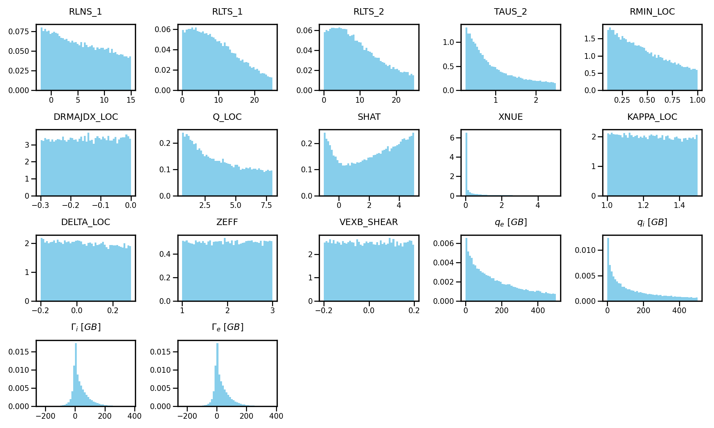
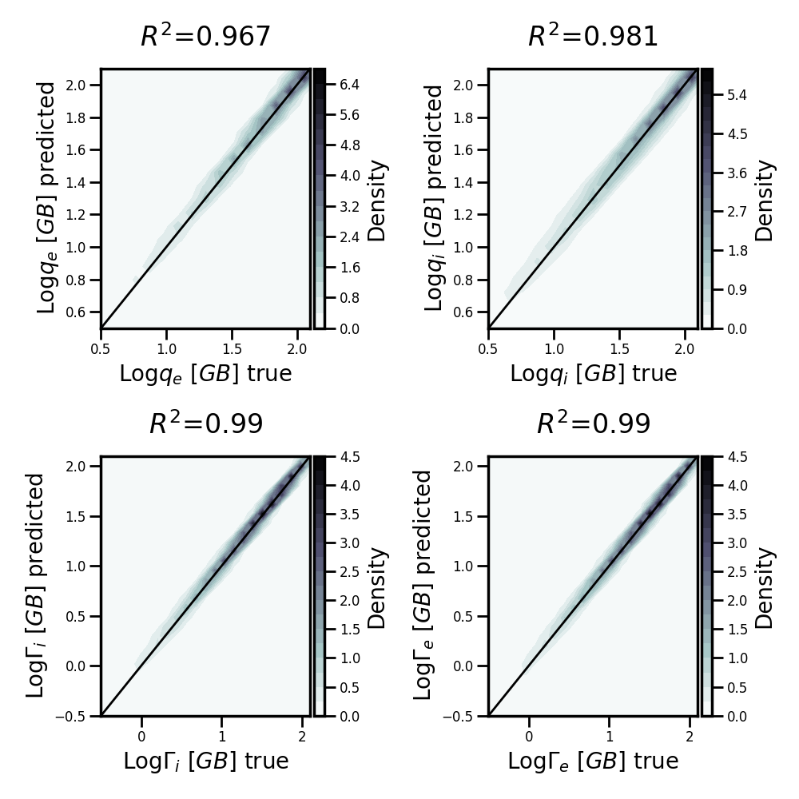

# 13D Hypercube
- The input space is obtained via Latin Hypercube Sampling based loosely on WEST, JET, AUG and TCV, and it consists of 1M TGLF SAT2 simulations. Further details on the TGLF settings can be found in [common_jet_hyper.tglf](common_jet_hyper.tglf) 
- The data distribution is likely suitable to model L-mode plasmas up to the edge and can be found below:
    
    - Fluxes above 500 GB have been deemed unphysical and have been removed, hence why the input dimensions are not samples of a uniform distribution, as would be instead expected from Latin Hypercube Sampling
    - The variables *must* be provided as input of the surrogate models in the following order
        `RLNS_1,RLTS_1,RLTS_2,TAUS_2,RMIN_LOC,DRMAJDX_LOC,Q_LOC,SHAT,XNUE,KAPPA_LOC,DELTA_LOC,ZEFF,VEXB_SHEAR`
    - Quasineutrality is enforced across the hypercube
    - `S_HAT` was spanned for practical reasons, but TGLF would require Q_PRIME_LOC. The following conversion formula can be used: `Q_PRIME_LOC= S_HAT * (Q_LOC/ RMIN_LOC)**2`
    - `R_MAJ_LOC` was fixed at a value of 3. Given that turbulent transport depends on just r/R, the combination of `RMIN_LOC` and `RMAJ_LOC` should still include the parameter spaces of machines with a major radius smaller than 3.
- The performance of the surrogate models is shown below:

    

    These plots have been obtained using the following test set: [test.pkl](test.pkl).  These plots have been obtained using the following test set: [test.pkl](test.pkl). In this file, the following convention is used: `efe_gb`=$`q_e \ [GB]`$, `efi_gb`=$`q_i \ [GB]`$, `pfi_gb`=$`\Gamma_i \ [GB]`$. The same naming convention is used for the NN checkpoints.
- The full config file used to train the surrogate models (inclusive of hyperparameters, and some arguments are redundant) can be found in [config.yaml](config.yaml)
- The mean and variance of each input and output variable is stored in [stats.json](stats.json). - The [scaler.pkl](scaler.pkl) file contains the scaler used to train the models. Simply load it using the `pickle` module in Python.
- None of the inputs and outputs require any scaling typical of ML models. This is handled internally in the NN checkpoints.

